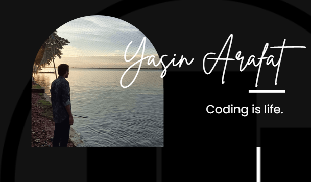

<!--

  
  
  
   
  
  
  
  
  
  
  
  
  
  
  

 

<!-- With Markdown Language -->

 

<!--  -->

- 📫 How to reach me **ug2102030@cse.pstu.ac.bd**

<!-- Connect with me facebook, and others -->

<h3 align="left">Connect with me:</h3>

<!-- Language and Tools -->

<h3 align="left">Languages and Tools:</h3>

 

 

      

<!-- Last Three Image -->

 

